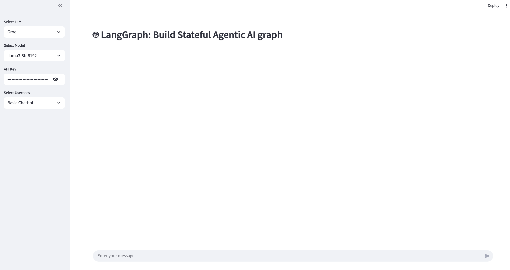
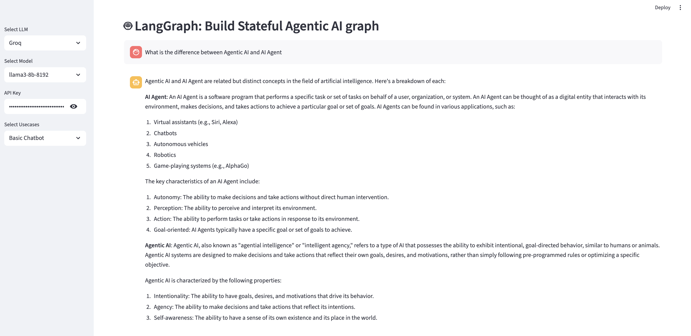
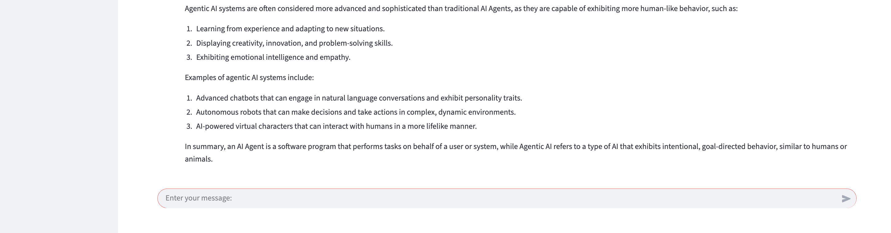

# 🤖 LangGraph Agentic AI Chatbot

A sophisticated conversational AI system built with LangGraph, featuring stateful graph-based architecture and modern web interface powered by Streamlit.

## 🌟 Overview

This project demonstrates an end-to-end implementation of an Agentic AI Chatbot using LangGraph's state management capabilities. The application provides a modular, extensible architecture that can be easily adapted for various conversational AI use cases.

## 🏗️ Architecture

The project follows a clean, modular architecture with clear separation of concerns:

```
src/langgraphagenticai/
├── LLMS/                    # Language Model configurations
│   └── groqllm.py          # Groq LLM integration
├── graph/                   # Graph building and management
│   └── graph_builder.py    # StateGraph construction
├── nodes/                   # Graph node implementations
│   └── basic_chatbot_node.py # Basic chatbot logic
├── state/                   # State management
│   └── state.py            # State schema definition
├── tools/                   # External tools integration
├── ui/                      # User interface components
│   ├── streamlitui/        # Streamlit-specific UI
│   │   ├── loadui.py       # UI loading and configuration
│   │   └── display_result.py # Result display logic
│   ├── uiconfigfile.py     # Configuration management
│   └── uiconfigfile.ini    # UI settings
└── main.py                  # Application entry point
```

## ✨ Features

### Core Capabilities
- **Stateful Conversations**: Maintains conversation context using LangGraph's state management
- **Modular Architecture**: Easy to extend with new nodes and capabilities
- **Multiple LLM Support**: Currently supports Groq models with extensible design
- **Interactive Web UI**: Clean, responsive Streamlit interface
- **Error Handling**: Comprehensive exception handling and user feedback

### Supported Models
- **Groq Models**:
  - llama3-8b-8192
  - llama3-70b-8192
  - gemma2-9b-it

### Use Cases
- Basic Chatbot (currently implemented)
- Extensible for additional agentic workflows

## 🚀 Quick Start

### Prerequisites
- Python 3.8+
- Groq API Key ([Get one here](https://console.groq.com/keys))

### Installation

1. **Clone the repository**
   ```bash
   git clone <repository-url>
   cd Agentic_Chatbot
   ```

2. **Create virtual environment**
   ```bash
   python -m venv venv
   source venv/bin/activate  # On Windows: venv\Scripts\activate
   ```

3. **Install dependencies**
   ```bash
   pip install -r requirements.txt
   ```

4. **Run the application**
   ```bash
   python app.py
   ```

5. **Access the web interface**
   - Open your browser and navigate to the provided Streamlit URL (typically `http://localhost:8501`)

## 🔧 Configuration

### API Keys
- Enter your Groq API key in the sidebar when prompted
- The application will validate the key before proceeding

### Model Selection
- Choose from available Groq models in the sidebar
- Each model has different capabilities and response characteristics

### Use Case Selection
- Currently supports "Basic Chatbot"
- Architecture designed for easy extension to additional use cases

## 📋 Dependencies

```
langchain              # LangChain framework
langgraph             # Graph-based workflow orchestration
langchain_community   # Community integrations
langchain_core        # Core LangChain components
langchain_groq        # Groq LLM integration
langchain_openai      # OpenAI integration (future use)
faiss-cpu            # Vector similarity search
streamlit            # Web UI framework
tavily-python        # Web search capabilities (future use)
```

## 🔄 How It Works

### Application Flow
1. **UI Initialization**: Streamlit interface loads with configuration options
2. **Model Configuration**: User selects LLM provider and model
3. **Graph Construction**: StateGraph is built based on selected use case
4. **Message Processing**: User input flows through the graph nodes
5. **Response Generation**: LLM generates contextual responses
6. **State Management**: Conversation state is maintained across interactions

### State Management
The application uses LangGraph's `TypedDict` state schema:
```python
class State(TypedDict):
    messages: Annotated[List, add_messages]
```

### Graph Architecture
- **START** → **chatbot** → **END**
- Extensible design allows for complex multi-node workflows
- Each node can modify the state and pass it to subsequent nodes

## 🛠️ Development

### Adding New Use Cases
1. Create new node classes in `src/langgraphagenticai/nodes/`
2. Update `GraphBuilder.setup_graph()` method
3. Add use case option to `uiconfigfile.ini`
4. Implement display logic in `display_result.py`

### Adding New LLM Providers
1. Create new LLM class in `src/langgraphagenticai/LLMS/`
2. Update UI configuration and selection logic
3. Modify `main.py` to handle new provider

### Extending Functionality
- Add tools in `src/langgraphagenticai/tools/`
- Implement complex workflows with multiple nodes
- Integrate external APIs and services

## 🐛 Troubleshooting

### Common Issues

**API Key Errors**
- Ensure your Groq API key is valid and has sufficient credits
- Check for typos in the API key input

**Model Loading Issues**
- Verify internet connection for model access
- Try different model options if one fails

**UI Not Loading**
- Check if all dependencies are installed correctly
- Ensure port 8501 is available

## 🤝 Contributing

1. Fork the repository
2. Create a feature branch (`git checkout -b feature/amazing-feature`)
3. Commit your changes (`git commit -m 'Add amazing feature'`)
4. Push to the branch (`git push origin feature/amazing-feature`)
5. Open a Pull Request


## 🙏 Acknowledgments

- [LangChain](https://langchain.com/) for the foundational framework
- [LangGraph](https://langchain-ai.github.io/langgraph/) for graph-based orchestration
- [Groq](https://groq.com/) for high-performance LLM inference
- [Streamlit](https://streamlit.io/) for the intuitive web interface

## 📞 Support

For questions, issues, or contributions, please:
- Open an issue on GitHub
- Check the documentation
- Review existing issues for solutions

---

**Built with ❤️ using LangGraph and modern AI technologies**

## Output






